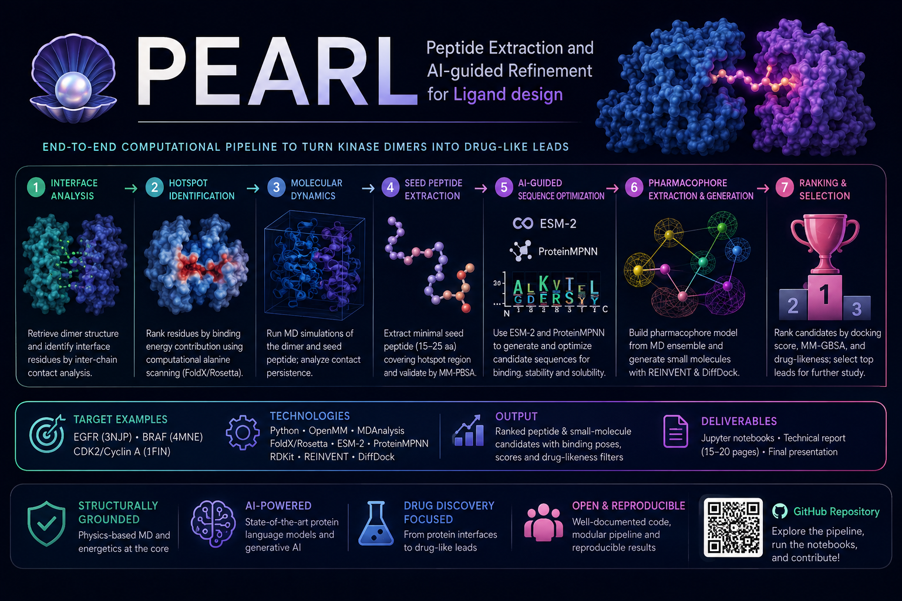

# PEARL — Peptide Extraction and AI-guided Refinement for Ligand Design

**From Dimers to Drugs**

PEARL is a computational drug-discovery project focused on reverse-engineering a kinase protein–protein interface and using structural bioinformatics, computational chemistry, molecular modelling and AI-guided optimisation to identify peptide and, ultimately, peptidomimetic or small-molecule inhibitor candidates.

The current prototype is developed on the **EGFR kinase-domain dimer (PDB: 3NJP)**.

> **Project status:** active research prototype.  
> The repository currently contains two consolidated peptide-design pipelines. Molecular-dynamics, protein-language-model and small-molecule lead-generation stages are planned as the next extensions.

---

## Project objective

The long-term PEARL workflow is designed to transform a crystallographic kinase dimer into a ranked set of candidate inhibitors through four broad stages:

```text
Kinase dimer structure
        ↓
1. Interface analysis and hotspot identification
        ↓
2. Molecular dynamics and interface validation
        ↓
3. AI-guided peptide sequence optimisation
        ↓
4. Pharmacophore extraction and lead generation
        ↓
Ranked peptide / peptidomimetic / small-molecule leads
```

The repository currently focuses primarily on interface/hotspot analysis, peptide miniaturisation, AI-guided local peptide optimisation and explicit structural validation with FoldX and Rosetta FlexPepDock.

---

## Biological system

- **Target:** Epidermal Growth Factor Receptor (EGFR)
- **Reference structure:** PDB `3NJP`
- **Studied protein–protein interface:** chains `B–D`
- **Reference short peptide:** `F0010`
- **F0010 sequence:** `IGERCQYRDLK`
- **Peptide source:** contiguous hotspot-rich region extracted from the EGFR dimer interface

The analyses in this repository are computational and should not be interpreted as experimental evidence of peptide binding, inhibition, affinity or therapeutic activity.

---

# Repository structure

```text
PEARL/
│
├── README.md
├── pearl.png
│
├── pipeline_1_initial_prototype/
│   ├── README.md
│   ├── 01_EGFR_PDB_to_Interface_Graph.ipynb
│   ├── 01B_Biological_Interface_Validation.ipynb
│   ├── 02b_Interface_Hotspot_AlanineScanning_FoldX_BuildModel_FIXED.ipynb
│   ├── 03b_Contiguous_Peptide_Window_Diffusion_EnergeticHotspots_FIXED.ipynb
│   └── 04b_Candidate_Validation_PreDocking_EnergeticHotspots.ipynb
│
└── pipeline_2_structural_validation_and_docking/
    ├── README.md
    ├── 02c_Hotspot_Centered_Peptide_Library.ipynb
    ├── 02d_Short_Peptide_Structural_and_Energetic_Ranking.ipynb
    ├── 03c_Short_Peptide_Structural_Preparation_and_Guided_Docking.ipynb
    ├── 03d_Top3_FlexPepDock_Deep_Refinement_N20.ipynb
    ├── 04c_CLEAR_Local_Peptide_Variant_Dataset.ipynb
    ├── 04d_CLEAR_Peptide_Oracle_Training.ipynb
    ├── 04e_CLEAR_Peptide_Counterfactual_Optimization.ipynb
    ├── 05c_CLEAR_Counterfactual_FoldX_and_Structural_Validation.ipynb
    ├── 05d_CLEAR_Counterfactual_FlexPepDock_Refinement.ipynb
    ├── 05e_CLEAR_Adjacent_Amino_Acid_Pair_Energy_Scoring.ipynb
    │
    └── vae_extension/
        ├── README.md
        ├── 06a_CLEAR_Peptide_VAE_Training.ipynb
        ├── 06b_CLEAR_VAE_Latent_Space_Analysis.ipynb
        ├── 06c_CLEAR_VAE_Latent_Counterfactual_Optimization.ipynb
        └── 06d_CLEAR_VAE_vs_Direct_CLEAR_Comparison.ipynb
```

> The repository is organised by **methodological pipeline**, not by a single uninterrupted notebook numbering scheme. Some Pipeline 2 notebooks revisit, replace or extend concepts introduced in Pipeline 1.

---

# Pipeline 1 — Initial Prototype

**Status: complete as historical/prototyping branch**

Directory:

```text
pipeline_1_initial_prototype/
```

Pipeline 1 established the first working PEARL prototype:

```text
PDB 3NJP
  ↓
interface identification
  ↓
biological-interface validation
  ↓
residue-contact graph
  ↓
FoldX alanine scanning
  ↓
energetic hotspot identification
  ↓
contiguous peptide extraction
  ↓
candidate generation
  ↓
pre-docking ranking
```

Its main role is to document the first implementation of the PEARL logic, from interface identification to seed-peptide and candidate generation.

---

# Pipeline 2 — Peptide Design, CLEAR Optimisation and Structural Validation

**Status: consolidated computational peptide-design branch**

Directory:

```text
pipeline_2_structural_validation_and_docking/
```

Pipeline 2 expands the initial prototype into two complementary peptide-design strategies.

```text
                          Pipeline 2
                              │
              ┌───────────────┴───────────────┐
              │                               │
     Branch A — Miniaturisation       Branch B — CLEAR
              │                               │
   hotspot-centred peptides            F0010 local landscape
              ↓                               ↓
 structural/energetic ranking              oracle
              ↓                               ↓
    FlexPepDock refinement             Direct CLEAR
                                              ↓
                                           FoldX
                                              ↓
                                       FlexPepDock
                                              ↓
                                        pair scoring
                                              ↓
                                       VAE extension
```

## Branch A — Hotspot-centred peptide miniaturisation

This branch evaluates shorter natural fragments derived directly from the EGFR interface.

```text
interface hotspot region
        ↓
nested peptide windows
        ↓
structural and energetic ranking
        ↓
guided docking preparation
        ↓
Rosetta FlexPepDock
        ↓
selection of a short natural reference
```

Among the evaluated fragments, the 11-residue peptide:

```text
F0010
IGERCQYRDLK
```

emerged as the main miniaturised reference for subsequent optimisation.

---

# Branch B — CLEAR-inspired local peptide optimisation

The second branch constructs a local and interpretable sequence-optimisation problem around F0010.

## Local peptide landscape

Notebook `04c` constructs a constrained local library around:

```text
IGERCQYRDLK
```

using one- and two-residue substitutions permitted by position-specific rules.

The current local dataset contains:

```text
539 peptide variants
```

and is used to build a surrogate peptide landscape.

## Peptide oracle

Notebook `04d` trains a differentiable GNN-based peptide oracle to approximate the local structural/energetic target.

The oracle is intended for **local candidate ranking and optimisation**. It is not a replacement for FoldX, Rosetta or experimental binding measurements.

## Direct CLEAR counterfactual optimisation

Notebook `04e` performs constrained counterfactual optimisation directly in peptide sequence/categorical space.

```text
F0010
  ↓
categorical amino-acid representation
  ↓
differentiable peptide oracle
  ↓
minimality + mutation constraints
  ↓
counterfactual peptide
```

Two especially important mutation patterns are:

```text
D9E
C5S + D9E
```

The minimal counterfactual is:

```text
IGERCQYRELK
D9E
```

while the strongest oracle-ranked local candidate is:

```text
IGERSQYRELK
C5S + D9E
```

---

# Structural validation

Candidate sequences generated by CLEAR are not accepted solely on the basis of the surrogate oracle.

They are subjected to explicit structure-based evaluation.

## FoldX validation

Notebook `05c` evaluates counterfactual candidates using FoldX BuildModel and structural consistency checks, including:

- mutation feasibility;
- receptor–peptide interaction energy;
- preservation of native interface contacts;
- hotspot retention;
- steric clashes;
- comparison with F0010.

A major result is that `C5S + D9E` shows a favourable FoldX profile.

## Rosetta FlexPepDock refinement

Notebook `05d` performs higher-resolution peptide–protein refinement using Rosetta FlexPepDock.

The strongest Rosetta-prioritised candidates include:

```text
CF_06   IGERCQYRELR   D9E + K11R
CF_10   IGERCQYRELQ   D9E + K11Q
CF_02   IGERSQYRELK   C5S + D9E
```

A central observation is that the single mutation `D9E`, although strongly favoured by the local oracle and FoldX, performs less favourably by itself in the deeper Rosetta refinement.

This suggests that the structural effect of D9E depends on its mutational context.

---

# Adjacent amino-acid pair scoring

Notebook `05e` introduces an interpretable, position-specific adjacent-pair score.

For a peptide:

```text
a1 a2 a3 ... aL
```

the sequence is decomposed into:

```text
(a1,a2), (a2,a3), ..., (aL-1,aL)
```

and a local empirical pair cost is estimated from the 04c dataset.

The pair score helps interpret why particular substitutions are repeatedly favoured.

It is a **surrogate energetic cost** and must not be interpreted as an absolute physical binding energy.

---

# Optional VAE Extension

Directory:

```text
pipeline_2_structural_validation_and_docking/vae_extension/
```

The VAE branch investigates whether the local F0010 sequence landscape can also be represented and searched through a learned continuous latent space.

```text
04c local peptide dataset
        ↓
06a true VAE training
        ↓
06b latent-space validation
        ↓
06c latent counterfactual optimisation
        ↓
06d comparison with Direct CLEAR
```

## True VAE representation

Notebook `06a` implements:

```text
peptide sequence
      ↓
encoder
      ↓
μ, logσ²
      ↓
reparameterisation
      ↓
latent z
      ↓
decoder
      ↓
amino-acid probabilities
```

## Latent-space validation

Notebook `06b` evaluates whether sequence similarity and the local target retain meaningful structure in the latent space.

The current model passed all predefined readiness checks for latent counterfactual optimisation.

## VAE-CLEAR counterfactual search

Notebook `06c` optimises the continuous latent vector while keeping the VAE decoder and peptide oracle frozen.

Successful VAE-CLEAR solutions include:

```text
IGERSQYRELK   C5S + D9E
IGERCQYRELK   D9E
IGERCQYREMK   D9E + L10M
IGERSQYRDLK   C5S
```

## Direct CLEAR vs VAE-CLEAR

Notebook `06d` compares the two counterfactual strategies.

Current result:

```text
Direct CLEAR successful sequences: 36
VAE-CLEAR successful sequences:     4
Shared VAE/Direct sequences:         4
VAE-only sequences:                  0
```

The VAE therefore does not expand the successful candidate space in this local experiment.

Its main contribution is **cross-method algorithmic convergence**.

In particular, both approaches independently recover:

```text
C5S + D9E
D9E
```

This convergence strengthens the computational prioritisation of those local mutation patterns, but it is **not independent biological validation**, because both methods ultimately depend on the same local peptide dataset and oracle.

---

# Current computationally prioritised candidates

The current peptide results should be interpreted as a **multi-method shortlist**, rather than as one absolute ranking.

| Candidate | Sequence | Mutations | Main interpretation |
|---|---|---|---|
| `CF_06` | `IGERCQYRELR` | D9E + K11R | strongest integrated Rosetta lead |
| `CF_10` | `IGERCQYRELQ` | D9E + K11Q | strong Rosetta-prioritised lead |
| `CF_02` | `IGERSQYRELK` | C5S + D9E | strongest Direct/VAE cross-method and FoldX candidate |
| `CF_05` | `IGERCEYRELK` | Q6E + D9E | favourable adjacent-pair profile |
| `F0010` | `IGERCQYRDLK` | natural reference | miniaturised interface-derived control |
| `CF_03` | `IGERCQYRELK` | D9E | minimal CLEAR/VAE counterfactual; weaker Rosetta result |

The recurrence of D9E across multiple optimisation strategies indicates that residue 9 is a central feature of the current local surrogate landscape.

However, Rosetta results suggest that D9E is more promising when combined with an appropriate second mutation.

---

# Current project status

| Stage | Status | Main content |
|---|---|---|
| Pipeline 1 — Initial prototype | ✅ Complete | PDB, interface graph, hotspot identification, initial seed/candidates |
| Pipeline 2A — Peptide miniaturisation | ✅ Complete | hotspot-centred fragments, FoldX, FlexPepDock, F0010 selection |
| Pipeline 2B — Direct CLEAR | ✅ Complete | local dataset, GNN oracle, counterfactual optimisation |
| Pipeline 2 — Structural validation | ✅ Complete | FoldX, FlexPepDock, pair-score interpretation |
| VAE extension | ✅ Complete | true VAE, latent analysis, latent CF optimisation, Direct-vs-VAE comparison |
| Molecular dynamics | 🔜 Next | dimer/peptide MD, contact persistence, stability, binding-energy estimates |
| ESM-2 / ProteinMPNN | 📌 Planned | protein-language-model and inverse-folding sequence design |
| Pharmacophore / small molecules | 📌 Planned | MD-derived pharmacophore, generative lead design and docking |

---

# Planned Pipeline 3 — Molecular Dynamics and Binding-Energy Analysis

The next major development is intended to cover the molecular-dynamics component of PEARL.

Proposed directory:

```text
pipeline_3_molecular_dynamics_and_binding_energy/
```

Possible modules:

```text
07a_EGFR_Dimer_OpenMM_MD_Setup.ipynb
07b_EGFR_Dimer_MD_Contact_Persistence.ipynb
07c_Selected_Peptide_MD_Analysis.ipynb
07d_MM_PBSA_or_MM_GBSA_Binding_Energy.ipynb
```

The objective will be to evaluate a compact number of representative systems, for example:

```text
EGFR B–D interface
F0010
CF_06
CF_02
```

Potential analyses include:

- OpenMM system preparation;
- AMBER-family protein force field;
- explicit solvent;
- minimisation and equilibration;
- production MD;
- peptide RMSD/RMSF;
- receptor–peptide contact persistence;
- hotspot-contact persistence;
- hydrogen-bond occupancy;
- trajectory clustering;
- approximate MM-PBSA/MM-GBSA comparison.

---

# Planned Pipeline 4 — Protein Language Models and Sequence Design

A later extension will investigate sequence design methods closer to the original PEARL specification.

Proposed directory:

```text
pipeline_4_protein_language_model_design/
```

Possible modules:

```text
08a_ESM2_Masked_Substitution_Profiling.ipynb
08b_ProteinMPNN_Backbone_Fixed_Design.ipynb
08c_PLM_Candidate_Filtering_and_Comparison.ipynb
```

The goal will be to compare independently generated sequence preferences against:

```text
Direct CLEAR
VAE-CLEAR
FoldX
Rosetta
MD
```

---

# Planned Pipeline 5 — Pharmacophore and Small-Molecule Lead Generation

The final planned stage moves from peptide optimisation toward peptidomimetic and small-molecule hypotheses.

Proposed directory:

```text
pipeline_5_pharmacophore_and_small_molecule_leads/
```

Possible modules:

```text
09a_MD_Derived_Pharmacophore.ipynb
09b_Generative_Small_Molecule_Design.ipynb
09c_DiffDock_Small_Molecule_Docking.ipynb
09d_MMGBSA_and_Druglikeness_Ranking.ipynb
```

Potential components include:

- MD-derived pharmacophore extraction;
- RDKit pharmacophore features;
- generative small-molecule design;
- DiffDock docking;
- MM-GBSA rescoring;
- Lipinski and Veber filters;
- final structural rationale for the top lead.

This stage is currently **planned and not yet implemented**.

---

# Methodological philosophy

PEARL uses a layered validation strategy:

```text
sequence hypothesis
        ↓
local surrogate / AI model
        ↓
explicit structural modelling
        ↓
higher-resolution docking/refinement
        ↓
molecular dynamics
        ↓
binding-energy estimation
        ↓
experimental validation
```

No individual computational method is treated as sufficient evidence by itself.

Agreement between several methods is used for **candidate prioritisation**, not for claiming experimentally confirmed binding.

---

# Main current conclusion

The current repository demonstrates an end-to-end computational peptide-design prototype starting from the EGFR dimer interface.

The workflow has:

1. identified and characterised the EGFR B–D interface;
2. identified energetic and structural hotspot regions;
3. extracted and miniaturised interface-derived peptides;
4. selected F0010 (`IGERCQYRDLK`) as a short natural reference;
5. constructed a 539-variant local peptide landscape;
6. trained a differentiable peptide oracle;
7. implemented Direct CLEAR-inspired counterfactual optimisation;
8. validated selected counterfactuals using FoldX and Rosetta FlexPepDock;
9. implemented an interpretable adjacent-pair surrogate score;
10. implemented a true VAE latent-space extension;
11. demonstrated cross-method convergence between Direct CLEAR and VAE-CLEAR.

The strongest current conclusion is that **double mutants containing D9E are repeatedly prioritised**, but their relative structural quality depends strongly on the accompanying mutation.

The next scientifically important step is therefore not further local sequence enumeration, but **molecular-dynamics-based validation of the interface and the most representative peptide leads**.

---

# Software and external dependencies

The notebooks use or may use:

- Python
- Jupyter Notebook
- NumPy
- pandas
- Matplotlib
- SciPy
- scikit-learn
- PyTorch
- Biopython
- NetworkX
- FoldX
- Rosetta FlexPepDock

Planned stages may additionally use:

- OpenMM
- MDAnalysis
- ESM-2 / ESMFold
- ProteinMPNN
- RDKit
- REINVENT
- DiffDock

FoldX, Rosetta and other external software packages must be installed separately and may require local executable/database paths.

---

# Limitations

Important limitations of the current work include:

- all current results are computational;
- the peptide landscape is intentionally local around F0010;
- the oracle is a surrogate trained on computational labels;
- VAE and Direct CLEAR share the same underlying local dataset and oracle;
- FoldX energies are approximate;
- FlexPepDock scores are not experimental affinities;
- adjacent-pair scores are empirical and not physical energies;
- molecular dynamics has not yet been incorporated into the current repository state;
- ESM-2 and ProteinMPNN design are planned but not yet integrated;
- no peptide has yet been experimentally synthesised or assayed;
- binding affinity, selectivity, stability, toxicity and cellular activity remain unknown.

The final peptide sequences should therefore be considered **computationally prioritised hypotheses**.

---

# Project deliverables

The PEARL work is being developed toward:

- reproducible and annotated Jupyter notebooks;
- a structured technical/scientific report;
- quantitative comparison of peptide candidates;
- structural visualisations;
- a final presentation explaining the complete target-to-lead workflow.

---

## Repository status summary

```text
PDB / interface / hotspots        ✅
Peptide extraction                ✅
Peptide miniaturisation           ✅
FoldX validation                  ✅
FlexPepDock refinement            ✅
Direct CLEAR optimisation         ✅
VAE latent optimisation           ✅
Cross-method comparison           ✅

Molecular dynamics                🔜 NEXT
MM-PBSA / MM-GBSA                 🔜 NEXT
ESM-2                             📌 PLANNED
ProteinMPNN                       📌 PLANNED
Pharmacophore extraction          📌 PLANNED
REINVENT / generative molecules  📌 PLANNED
DiffDock                          📌 PLANNED
Drug-likeness filtering           📌 PLANNED
Experimental validation           ⏳ FUTURE
```

---

## Disclaimer

This repository is an academic computational prototype.

The generated peptides and molecular candidates are research hypotheses and are **not validated drugs, inhibitors or therapeutic compounds**.
