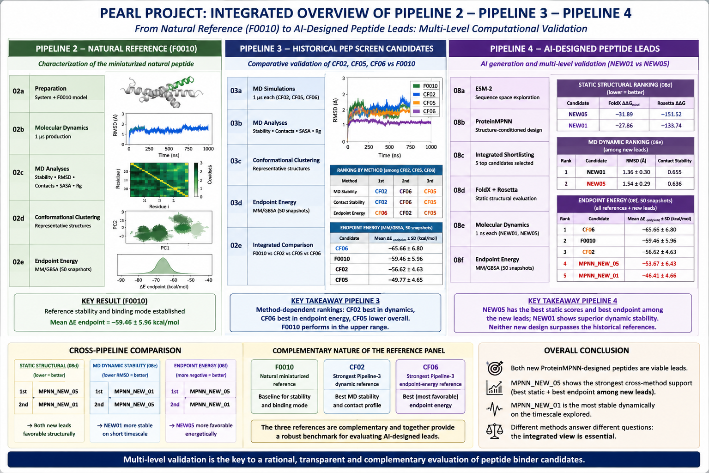

<p align="center">
  
</p>

# PEARL Pipeline 4 — Protein Language Models and AI-Guided Peptide Design

This directory contains the protein-language-model and structure-conditioned peptide-design stage of the PEARL project.

Pipeline 4 extends the previous CLEAR, FoldX, Rosetta and molecular-dynamics workflow by introducing two complementary AI components:

```text
ESM-2
+
ProteinMPNN
```

The objective is not to replace the structural and physical validation developed in Pipelines 2 and 3.

Instead, Pipeline 4 asks a new question:

> Can pretrained protein-sequence and structure-conditioned generative models propose peptide sequences that are plausible, structurally compatible with the EGFR interface, and competitive with the previously selected CLEAR-derived leads?

The resulting AI-generated peptides are therefore subjected to the same layered validation philosophy used elsewhere in PEARL:

```text
AI sequence proposal
        ↓
AI-level prioritization
        ↓
FoldX
        ↓
Rosetta FlexPepDock
        ↓
explicit-solvent MD
        ↓
endpoint energetic comparison
```

The analyses contained in this directory are computational and do not constitute experimental evidence of peptide binding, inhibition, affinity or biological activity.

---

## Relationship with Pipelines 2 and 3

Pipeline 2 produced the short natural reference peptide:

```text
F0010 = IGERCQYRDLK
```

and selected CLEAR-derived counterfactual candidates including:

```text
CF06 = IGERCQYRELR
CF02 = IGERSQYRELK
```

Pipeline 3 then subjected these established candidates to explicit-solvent molecular dynamics and comparative endpoint-energy analysis.

Pipeline 4 starts from this already validated PEARL context and adds an independent AI-driven design branch.

```text
Pipeline 2
F0010 + CLEAR candidates
        ↓
Pipeline 3
MD + endpoint-energy comparison
        ↓
Pipeline 4
ESM-2 sequence analysis
        +
ProteinMPNN inverse folding
        ↓
new AI-generated peptide candidates
        ↓
FoldX + Rosetta + MD
        ↓
comparison with F0010 / CF06 / CF02
```

The established candidates remain important references throughout Pipeline 4, but with deliberately complementary roles:

```text
F0010  natural / miniaturized reference
CF02   strongest Pipeline-3 dynamic-stability reference
CF06   strongest Pipeline-3 structural / endpoint-energy reference
```

Pipeline 3 also showed that the empirical adjacent-pair lead `CF05` was not confirmed by the final 1 ns MD and endpoint analyses. This is used as a methodological reminder that no single local, structural, dynamic or energetic score should be treated as a universal winner.

---

## Biological and structural system

- **Target:** Epidermal Growth Factor Receptor, EGFR
- **Reference structure:** PDB `3NJP`
- **Interface studied:** chains `B–D`
- **Receptor chain:** `B`
- **Peptide chain:** `D`
- **Natural short reference:** `F0010 = IGERCQYRDLK`
- **CLEAR references:** `CF06` and `CF02`

For ProteinMPNN design, receptor chain `B` is kept fixed while peptide chain `D` is redesigned under position-specific constraints.

The design is deliberately local rather than unconstrained.

Six F0010 positions supported by the earlier FoldX + MD hotspot analysis are preserved during ProteinMPNN generation.

The remaining positions are allowed to vary.

---

## Pipeline overview

```text
F0010 / CF06 / CF02
        ↓
08a — ESM-2 sequence plausibility
        ↓
F0010 structure
        ↓
08b — ProteinMPNN structure-conditioned generation
        ↓
ProteinMPNN candidate pool
        ↓
08c — ESM-2 + ProteinMPNN integrated prioritization
        ↓
5 new candidates
        ↓
08d — FoldX + Rosetta structural validation
        ↓
top 2 new candidates
        ↓
08e — explicit-solvent MD
        ↓
comparison with F0010 / CF06 / CF02
        ↓
08f — MM/GBSA-like endpoint-energy comparison
        ↓
08g — ESMFold structural plausibility
        ↓
08h — solubility / developability screening
        ↓
08i — Bayesian optimisation framework
        ↓
08j — final multi-objective ranking
```

---

## Notebooks included

- `08a_ESM2_Peptide_Sequence_Scoring.ipynb`
- `08b_ProteinMPNN_Structure_Conditioned_Peptide_Design.ipynb`
- `08c_ESM2_ProteinMPNN_Integrated_Candidate_Selection.ipynb`
- `08d_ProteinMPNN_Candidate_Structural_Validation.ipynb`
- `08e_Top_ProteinMPNN_Lead_MD_Validation.ipynb`
- `08f_ProteinMPNN_Endpoint_Energy_Comparison.ipynb`
- `08g_ESMFold_Structural_Validation.ipynb`
- `08h_Solubility_Developability_Screening.ipynb`
- `08i_Bayesian_Optimisation_BoTorch.ipynb`
- `08j_Final_Multi_Objective_Ranking.ipynb`

---

## Recommended execution order

```text
08a_ESM2_Peptide_Sequence_Scoring
        ↓
08b_ProteinMPNN_Structure_Conditioned_Peptide_Design
        ↓
08c_ESM2_ProteinMPNN_Integrated_Candidate_Selection
        ↓
08d_ProteinMPNN_Candidate_Structural_Validation
        ↓
08e_Top_ProteinMPNN_Lead_MD_Validation
        ↓
08f_ProteinMPNN_Endpoint_Energy_Comparison
        ↓
08g_ESMFold_Structural_Validation
        ↓
08h_Solubility_Developability_Screening
        ↓
08i_Bayesian_Optimisation_BoTorch
        ↓
08j_Final_Multi_Objective_Ranking
```

Notebooks `08a–08d` are primarily executed in the dedicated AI environment.

Notebooks `08e–08f` use the molecular-dynamics environment established in Pipeline 3.

---

# Notebook descriptions

## `08a_ESM2_Peptide_Sequence_Scoring.ipynb`

This notebook introduces ESM-2 into the PEARL workflow.

The model used is:

```text
esm2_t6_8M_UR50D
```

The main reference sequences are:

```text
F0010 = IGERCQYRDLK
CF06  = IGERCQYRELR
CF02  = IGERSQYRELK
```

ESM-2 is used here as a **pretrained sequence-plausibility prior**.

It is not used as a receptor-binding predictor.

### Main operations

The notebook performs:

- loading of the pretrained ESM-2 model;
- sequence validation;
- masked pseudo-log-likelihood calculation;
- pseudo-perplexity calculation;
- position-wise amino-acid support analysis;
- mutation-site comparison;
- sequence embedding extraction;
- cosine similarity to F0010;
- PCA visualization of peptide embeddings;
- integration with previous PEARL structural and MD results.

For a peptide sequence, every residue is masked individually and the log-probability assigned by ESM-2 to the original amino acid is recorded.

The mean masked pseudo-log-likelihood is used as the main sequence-plausibility metric.

### Core sequence result

Among the three established PEARL candidates, the ESM-2 ranking obtained in this analysis was:

```text
CF02
CF06
F0010
```

with approximate masked mean pseudo-log-likelihoods:

| Candidate | Mean masked PLL | Pseudo-perplexity |
|---|---:|---:|
| **CF02** | **−3.120** | **22.65** |
| **CF06** | −3.232 | 25.32 |
| **F0010** | −3.240 | 25.54 |

The three sequences remain very close in ESM-2 embedding space.

This supports the interpretation that the CLEAR-derived mutations remain compatible with a plausible protein-like local sequence context.

### Important limitation

A favourable ESM-2 score means that a sequence appears plausible under the pretrained sequence model.

It does **not** demonstrate:

```text
binding affinity
receptor specificity
structural stability
biological inhibition
```

Those properties require downstream structural and physical evaluation.

---

## `08b_ProteinMPNN_Structure_Conditioned_Peptide_Design.ipynb`

This notebook uses ProteinMPNN for structure-conditioned peptide sequence design.

Unlike ESM-2, which evaluates sequence plausibility, ProteinMPNN proposes sequences conditioned on the three-dimensional receptor–peptide structure.

The receptor chain is fixed:

```text
chain B
```

while peptide chain `D` is designed.

### Protected and designable peptide positions

The design is constrained around the F0010 sequence:

```text
I G E R C Q Y R D L K
1 2 3 4 5 6 7 8 9 10 11
```

Six positions supported by the previous FoldX + MD hotspot analysis are fixed.

The remaining positions are allowed to mutate.

Conceptually:

```text
structure-supported hotspot positions
        ↓
fixed during ProteinMPNN design

non-protected positions
        ↓
designable
```

This prevents ProteinMPNN from completely replacing the interface motif and keeps the search biologically connected to the PEARL seed.

### Production generation

The production run generated:

```text
100 sampled sequences
24 unique peptide designs
```

using two sampling temperatures:

```text
0.1
0.2
```

A strong recurring motif emerged around:

```text
TGPRNQYRDLX
```

The top ProteinMPNN sequence was:

```text
TGPRNQYRDLP
```

with four substitutions relative to F0010.

Importantly, neither F0010 nor the previously selected CF06/CF02 sequences were simply reproduced by ProteinMPNN.

This indicates that the inverse-folding model explores a substantially different local sequence preference from CLEAR.

### Interpretation

ProteinMPNN answers a different question from the CLEAR oracle.

CLEAR asks approximately:

> Which local sequence modifications improve the learned PEARL target while remaining close to F0010?

ProteinMPNN asks approximately:

> Which peptide sequence is compatible with this receptor-bound backbone and the imposed fixed-position constraints?

The two methods are therefore complementary rather than redundant.

---

## `08c_ESM2_ProteinMPNN_Integrated_Candidate_Selection.ipynb`

This notebook integrates ProteinMPNN and ESM-2 evidence and reduces the generated candidate pool to a small shortlist suitable for expensive structural validation.

For every unique ProteinMPNN design, the notebook evaluates:

```text
ProteinMPNN score
+
sampling frequency
+
ESM-2 masked PLL
+
sequence locality to F0010
+
overlap with previous CLEAR/local sequence space
```

The integrated prioritization is deliberately transparent.

The descriptive weighting used in the notebook is:

```text
30% ProteinMPNN score
25% ESM-2 PLL
20% ProteinMPNN sampling frequency
25% locality to F0010
```

This integrated score is **not a physical energy**.

It is used only to reduce the AI-generated sequence set to a manageable number of hypotheses.

### Final shortlist

Five new ProteinMPNN-derived candidates were selected:

| Candidate | Sequence | Integrated AI score |
|---|---|---:|
| **MPNN_NEW_01** | `TGPRNQYRDLP` | **0.601** |
| **MPNN_NEW_02** | `IGPRNQYRDLG` | 0.551 |
| **MPNN_NEW_04** | `IGPRNQYRDLN` | 0.514 |
| **MPNN_NEW_05** | `IGPRHQYRDLP` | 0.509 |
| **MPNN_NEW_03** | `PGPRNQYRDLP` | 0.402 |

All five were novel relative to the local `04c` / CLEAR sequence space used earlier in PEARL.

`MPNN_NEW_03` was retained despite a lower integrated score because it provided complementary ESM-2 evidence.

### Interpretation

The shortlist is intentionally diverse.

The objective is not to select a final peptide from AI scores alone.

The candidates must still pass:

```text
FoldX
Rosetta
MD
endpoint-energy evaluation
```

---

## `08d_ProteinMPNN_Candidate_Structural_Validation.ipynb`

This notebook performs explicit structure-based validation of the five candidates selected in `08c`.

The validation contains two major layers:

```text
FoldX
+
Rosetta FlexPepDock
```

### FoldX phase

For each candidate, the notebook:

- maps the sequence onto the F0010 peptide structure;
- prepares candidate-specific mutation input;
- builds the mutated complex;
- checks the resulting structures;
- runs or prepares FoldX `AnalyseComplex`;
- extracts receptor–peptide interaction energies;
- ranks the five new candidates.

### Rosetta phase

The structurally prepared candidates are subsequently refined using Rosetta FlexPepDock.

Production refinement uses:

```text
nstruct = 20
```

for each candidate.

For the five-candidate panel this corresponds to:

```text
100 Rosetta decoys
```

in total.

The principal Rosetta interface metric is `I_sc`, where more negative values are considered more favourable within the Rosetta protocol.

### Integrated structural ranking

The final structural ranking was:

```text
1. MPNN_NEW_05
2. MPNN_NEW_01
3. MPNN_NEW_02
4. MPNN_NEW_04
5. MPNN_NEW_03
```

The two strongest candidates were therefore advanced to molecular dynamics:

```text
MPNN_NEW_05 = IGPRHQYRDLP
MPNN_NEW_01 = TGPRNQYRDLP
```

### Key structural results

For `MPNN_NEW_05`:

```text
FoldX interaction energy ≈ −13.75 kcal/mol
Rosetta best I_sc       ≈ −56.12
```

For `MPNN_NEW_01`:

```text
FoldX interaction energy ≈ −11.74 kcal/mol
Rosetta best I_sc       ≈ −54.17
```

`MPNN_NEW_05` therefore showed the strongest combined static structural evidence.

A particularly informative result was obtained for `MPNN_NEW_03`.

It had strong sequence-level plausibility under ESM-2 but ranked poorly after FoldX/Rosetta validation.

This demonstrates an important Pipeline 4 principle:

```text
sequence plausibility
≠
favourable receptor–peptide interface energetics
```

---

## `08e_Top_ProteinMPNN_Lead_MD_Validation.ipynb`

This notebook performs explicit-solvent molecular dynamics on the two strongest new ProteinMPNN candidates:

```text
MPNN_NEW_05 = IGPRHQYRDLP
MPNN_NEW_01 = TGPRNQYRDLP
```

The previously established PEARL references:

```text
F0010
CF06
CF02
```

are not simulated again.

Their existing 1 ns Pipeline 3 results are imported for direct comparison.

### MD protocol

The simulation protocol is intentionally aligned with Pipeline 3:

```text
AMBER ff14SB
TIP3P water
0.15 M NaCl
300 K
1 bar
2 fs timestep

minimization
→ 100 ps NVT
→ 100 ps NPT
→ 1 ns production

500 production frames
```

For each new candidate the notebook evaluates:

- receptor-aligned peptide Cα RMSD;
- peptide Cα RMSF;
- B–D heavy-atom contact persistence;
- number of contacts persistent in at least 50% of frames;
- mean contact persistence;
- thermodynamic quality-control metrics.

### Production results

| Candidate | Mean peptide RMSD (Å) | Mean peptide RMSF (Å) | Persistent contacts ≥50% | Mean contact persistence |
|---|---:|---:|---:|---:|
| **CF02** | **0.901** | **0.737** | 43 | **0.603** |
| **MPNN_NEW_01** | 1.268 | 0.920 | 41 | 0.599 |
| **CF06** | 1.293 | 0.904 | **45** | 0.529 |
| **MPNN_NEW_05** | 1.417 | 0.831 | 40 | 0.535 |
| **F0010** | 1.966 | 1.164 | 43 | 0.541 |

The descriptive MD ranking was therefore:

```text
1. CF02
2. MPNN_NEW_01
3. CF06
4. MPNN_NEW_05
5. F0010
```

### Interpretation

The result is scientifically important because the static and dynamic rankings are not identical.

Static FoldX/Rosetta validation favoured:

```text
MPNN_NEW_05
```

whereas the 1 ns MD comparison favoured:

```text
MPNN_NEW_01
```

among the two ProteinMPNN-derived leads.

`MPNN_NEW_01` also became highly competitive with the established CLEAR candidates during MD.

This demonstrates why the Pipeline 4 workflow does not accept a static structural score as final evidence.

---

## `08f_ProteinMPNN_Endpoint_Energy_Comparison.ipynb`

This notebook provides the final energetic comparison for the two ProteinMPNN leads after `08e`.

The production analysis uses **50 uniformly distributed snapshots** from each 1 ns trajectory of `MPNN_NEW_05` and `MPNN_NEW_01`. For each snapshot:

```text
ΔE_endpoint = E_complex - E_receptor - E_peptide
```

The energies are evaluated from the same complex geometry with an AMBER protein force field and OBC2 implicit solvent. The calculation is therefore a **single-trajectory MM/GBSA-like endpoint-energy proxy**.

The established Pipeline 3 endpoint results are imported from the official `07e_endpoint_energy_summary.csv` rather than recomputed. The five-candidate reference panel is:

```text
F0010        natural / miniaturized reference
CF02         Pipeline-3 dynamic reference
CF06         Pipeline-3 structural / energetic reference
MPNN_NEW_05  ProteinMPNN lead selected by 08d
MPNN_NEW_01  ProteinMPNN lead selected by 08d
```

### Production results

| Endpoint rank | Candidate | Mean ΔE endpoint (kcal/mol) | SD (kcal/mol) | Interpretation within this protocol |
|---:|---|---:|---:|---|
| **1** | **CF06** | **-65.66** | 6.80 | most favorable established endpoint proxy |
| 2 | F0010 | -59.46 | 5.96 | natural reference |
| 3 | CF02 | -56.62 | 4.63 | strongest dynamic reference, weaker endpoint than CF06 |
| **4** | **MPNN_NEW_05** | **-53.67** | 6.43 | best ProteinMPNN endpoint result |
| 5 | MPNN_NEW_01 | -46.41 | 4.66 | less favorable ProteinMPNN endpoint result |

Among the two new ProteinMPNN designs, `MPNN_NEW_05` is therefore favored by the endpoint layer. However, neither new design exceeds the established Pipeline-3 references in this endpoint-energy comparison.

### Cross-method consequence

The final ProteinMPNN comparison is intentionally multi-criteria:

```text
08d FoldX / Rosetta  -> MPNN_NEW_05 > MPNN_NEW_01
08e 1 ns MD          -> MPNN_NEW_01 > MPNN_NEW_05
08f endpoint energy  -> MPNN_NEW_05 > MPNN_NEW_01
```

`MPNN_NEW_05` therefore has the strongest **cross-method support among the new AI-derived designs**, because its superior static FoldX/Rosetta evidence is reinforced by the more favorable endpoint result. `MPNN_NEW_01` remains an important complementary lead because it showed the stronger short-timescale dynamic behavior in `08e`.

### Important limitation

The endpoint quantity is **not a rigorous absolute binding free energy**. It does not include configurational entropy, multiple independent MD replicas, long-timescale convergence, independent receptor/peptide relaxation, alchemical transformations or experimental calibration. The snapshots are also time-correlated because they are extracted from one short trajectory per candidate.

The reported values should therefore be interpreted as comparative energetic descriptors, not as experimental or absolute `ΔG`, `Kd`, `Ki` or `IC50`.

---


## 08g–08j — Structural plausibility, developability and final decision support

The final extension of Pipeline 4 adds four downstream modules after the 08f endpoint comparison. These modules use the two candidates actually advanced from 08d/08e:

```text
MPNN_NEW_01 = TGPRNQYRDLP
MPNN_NEW_05 = IGPRHQYRDLP
```

### 08g — ESMFold structural plausibility

08g imports external ColabFold/ESMFold PDB predictions and validates file integrity, sequence identity and residue count. Both candidates produced valid 11-residue structures. Mean pLDDT was 72.56 for MPNN_NEW_01 and 67.27 for MPNN_NEW_05. These values are reported only as structural-confidence descriptors. For short peptides, pLDDT, pTM, PAE and RMSD are uncertain and must not be interpreted as binding affinity or energetic evidence.

### 08h — Solubility / developability screening

08h performs a transparent sequence-derived triage. MPNN_NEW_01 has net charge proxy +1 and hydrophobic fraction 0.182; MPNN_NEW_05 has +2 and 0.273. The executed run did not include CamSol, so these are proxies rather than experimental or calibrated solubility predictions.

### 08i — Bayesian optimisation framework

08i harmonises endpoint energy, structural confidence and developability evidence. BoTorch was not available in the executed environment and only two candidates were observed. The notebook therefore does not fabricate a new sequence or claim a validated Gaussian-process posterior. A defensible Bayesian optimisation campaign requires a larger measured design set and explicit acquisition-function validation.

### 08j — Final multi-objective ranking

08j combines the available signals with equal, configurable weights. The resulting decision-support ranking is:

```text
1. MPNN_NEW_01  TGPRNQYRDLP
2. MPNN_NEW_05  IGPRHQYRDLP
```

MPNN_NEW_05 remains the stronger ProteinMPNN lead in the endpoint-energy component and the static FoldX/Rosetta layer, while MPNN_NEW_01 has stronger short-timescale MD behaviour, higher mean pLDDT and lower hydrophobicity proxy. The final ordering is therefore a trade-off, not a universal biological winner.

These four modules complete Pipeline 4 as an AI-guided peptide sequence-optimisation and computational prioritisation workflow. They do not replace biochemical binding, stability, solubility or cellular validation.

### Additional outputs

The 08g–08j modules may generate:

- validated external ESMFold/ColabFold PDB files;
- pLDDT, PAE and optional RMSD summaries;
- PDB provenance and integrity QC;
- sequence-derived developability tables and plots;
- integrated evidence tables;
- BoTorch availability and proposal-status reports;
- exploratory and final multi-objective rankings;
- sensitivity-ready score components;
- Markdown reports and QC tables.

The default output directories are:

```text
pipeline_4_ai_08g_esmfold_structural_validation/
pipeline_4_ai_08h_solubility_developability/
pipeline_4_ai_08i_bayesian_optimisation/
pipeline_4_ai_08j_final_multiobjective/
```


# Cross-method interpretation

Pipeline 4 intentionally separates several different concepts.

## ESM-2

Measures:

```text
sequence plausibility
```

It does not directly measure receptor binding.

## ProteinMPNN

Measures:

```text
structure-conditioned sequence compatibility
```

It proposes sequences compatible with a given structural context.

## FoldX

Provides:

```text
approximate receptor–peptide interaction energetics
```

on static candidate structures.

## Rosetta FlexPepDock

Provides:

```text
high-resolution structural refinement
+
interface scoring
```

under the Rosetta energy model.

## Molecular dynamics

Tests:

```text
short-timescale dynamic stability
+
interface-contact persistence
```

in explicit solvent.

## Endpoint energy

Adds:

```text
comparative MM/GBSA-like energetic evidence
```

from MD-derived snapshots.

No single one of these methods is considered sufficient on its own.

---

## Main AI-generated candidates

The most important new Pipeline 4 sequences are:

```text
MPNN_NEW_01
TGPRNQYRDLP

MPNN_NEW_05
IGPRHQYRDLP
```

They emerged for different reasons.

### MPNN_NEW_05

Strongest evidence in:

```text
FoldX
Rosetta FlexPepDock
```

and therefore the strongest static ProteinMPNN-derived lead.

### MPNN_NEW_01

Strongest evidence among the new ProteinMPNN peptides in:

```text
1 ns molecular dynamics
```

and highly competitive with the established CLEAR leads.

The difference between these two candidates is a useful example of PEARL's layered-validation philosophy.

---

# Established versus AI-derived design

Pipeline 4 creates a useful methodological comparison.

```text
CLEAR branch
        ↓
local sequence optimization
around F0010
        ↓
CF06 / CF02

ProteinMPNN branch
        ↓
structure-conditioned
inverse folding
        ↓
MPNN_NEW_01 / MPNN_NEW_05
```

The CLEAR candidates and ProteinMPNN candidates are generated using fundamentally different objectives.

Agreement between the two approaches is therefore not required.

Differences between them are scientifically informative because they reveal how:

```text
local target optimization
```

and:

```text
structure-conditioned generative design
```

explore different regions of peptide sequence space.

---

## External software

### ESM-2 / fair-esm

ESM-2 is used for:

- masked pseudo-log-likelihood;
- pseudo-perplexity;
- mutation-site support;
- sequence embeddings;
- embedding similarity;
- sequence-space visualization.

The implementation uses the `fair-esm` Python package.

### ProteinMPNN

The official ProteinMPNN implementation is used for structure-conditioned peptide design.

The workflow requires:

- a valid ProteinMPNN repository installation;
- model weights;
- multi-chain preprocessing scripts;
- fixed/designable chain configuration;
- position-specific residue constraints.

### FoldX

FoldX is used for:

- mutated peptide-complex construction;
- receptor–peptide interaction-energy analysis;
- structural screening before Rosetta.

FoldX must be installed separately.

### Rosetta FlexPepDock

Rosetta FlexPepDock is used for high-resolution receptor–peptide refinement.

Production validation in `08d` uses:

```text
nstruct = 20
```

per candidate.

### OpenMM

OpenMM is used in `08e` and `08f` for:

- explicit-solvent molecular dynamics;
- trajectory generation;
- endpoint-energy evaluation.

---

## Python environments

Pipeline 4 uses two principal environments.

### AI environment

Recommended kernel:

```text
Python (PEARL AI)
```

Typical dependencies include:

- Python 3.11;
- PyTorch;
- fair-esm;
- NumPy;
- pandas;
- Matplotlib;
- scikit-learn;
- Biopython;
- pathlib;
- subprocess utilities.

This environment is used primarily for:

```text
08a
08b
08c
08d
```

### Molecular-dynamics environment

Recommended kernel:

```text
Python (PEARL MD)
```

Typical dependencies include:

- Python 3.11;
- OpenMM;
- PDBFixer;
- MDAnalysis;
- NumPy;
- pandas;
- Matplotlib.

This environment is used primarily for:

```text
08e
08f
```

---

## Expected outputs

Depending on the notebook, Pipeline 4 may generate:

- ESM-2 sequence-score tables;
- masked position-wise log-probabilities;
- mutation-site support tables;
- ESM-2 embeddings;
- embedding similarity tables;
- PCA coordinates and plots;
- ProteinMPNN input structures;
- chain-assignment configuration files;
- fixed-position dictionaries;
- ProteinMPNN generated FASTA files;
- unique sequence tables;
- amino-acid preference summaries;
- integrated AI candidate rankings;
- selected candidate shortlists;
- FoldX mutation input files;
- FoldX-built structures;
- FoldX `AnalyseComplex` outputs;
- FoldX interaction-energy rankings;
- Rosetta FlexPepDock scripts;
- Rosetta score files;
- refined PDB decoys;
- integrated structural rankings;
- selected candidates for MD;
- DCD molecular-dynamics trajectories;
- RMSD and RMSF tables;
- contact-persistence tables;
- MD ranking tables;
- endpoint-energy snapshot tables;
- endpoint-energy summary tables;
- diagnostic plots;
- Markdown reports;
- CSV reports.

Generated data are generally stored below:

```text
outputs/
```

using notebook-specific directories such as:

```text
pipeline_4_ai_08a_esm2_sequence_scoring/
pipeline_4_ai_08b_proteinmpnn_design/
pipeline_4_ai_08c_integrated_candidate_selection/
pipeline_4_ai_08d_structural_validation/
pipeline_4_ai_08e_top_mpnn_md/
pipeline_4_ai_08f_endpoint_energy/
```

Large trajectory files, Rosetta decoy collections, external software installations and downloaded model weights should normally not be committed to the GitHub repository unless intentionally archived.

---

## Interpretation and limitations

Pipeline 4 introduces powerful pretrained AI models, but their outputs require careful interpretation.

### ESM-2 is not an affinity predictor

A favourable masked pseudo-log-likelihood indicates sequence plausibility under the pretrained language model.

It does not establish:

```text
binding
affinity
selectivity
inhibition
stability in solution
```

### ProteinMPNN is not an affinity predictor

ProteinMPNN proposes sequences that are compatible with a structural environment.

A favourable ProteinMPNN score does not guarantee stronger receptor binding.

### Structure-conditioned design depends on the input backbone

ProteinMPNN sequence preferences depend on:

- the selected receptor–peptide structure;
- the fixed peptide backbone;
- protected positions;
- designable positions;
- sampling temperature;
- model version.

Alternative starting conformations may produce different sequence preferences.

### The integrated AI score is descriptive

The weighted score in `08c` combines:

```text
ProteinMPNN
ESM-2
frequency
locality
```

for candidate prioritization.

It is not a calibrated biological score and is not measured in physical units.

### FoldX and Rosetta remain approximate

The structural-validation stage remains dependent on the assumptions of the FoldX and Rosetta scoring functions.

Small score differences should not automatically be interpreted as biologically meaningful.

### MD remains short-timescale

The current production comparison uses 1 ns trajectories.

This is useful for comparative screening and detecting obvious instability but is not sufficient to establish full conformational convergence.

Longer trajectories and independent replicas would strengthen the conclusions.

### Endpoint energy is not absolute affinity

The MM/GBSA-like endpoint calculation is a comparative proxy.

It should not be converted directly into experimental affinity without additional methodological validation.

### Experimental validation remains required

The final Pipeline 4 candidates remain computational hypotheses.

Experimental studies would be required to determine:

- peptide binding;
- affinity;
- inhibition;
- selectivity;
- stability;
- solubility;
- toxicity;
- cellular activity.

---

# Main Pipeline 4 conclusion

Pipeline 4 successfully adds an independent protein-language-model and inverse-folding design branch to PEARL and carries the new designs through the same layered validation philosophy used for the established peptide references.

The main methodological achievements are:

1. ESM-2 masked sequence scoring of the established PEARL candidates;
2. constrained ProteinMPNN design on the EGFR B-D receptor-peptide structure;
3. generation of 100 ProteinMPNN samples corresponding to 24 unique sequences;
4. integrated ESM-2 / ProteinMPNN prioritization of five novel candidates;
5. FoldX and Rosetta validation of all five candidates;
6. selection of `MPNN_NEW_05` and `MPNN_NEW_01` for explicit-solvent MD;
7. 1 ns MD comparison showing stronger short-timescale dynamic behavior for `MPNN_NEW_01`;
8. production endpoint analysis on 50 snapshots per new candidate;
9. endpoint ranking showing `MPNN_NEW_05` as the stronger energetic ProteinMPNN lead;
10. direct five-candidate comparison with `F0010`, `CF02` and `CF06`;
11. independent structural plausibility assessment of the two advanced candidates;
12. preliminary developability screening;
13. explicit Bayesian-optimisation readiness assessment;
14. transparent final multi-objective decision-support ranking.

The final cross-method picture is:

```text
Established references
F0010  -> natural / miniaturized reference
CF02   -> strongest dynamic-stability reference
CF06   -> strongest structural / endpoint-energy reference

ProteinMPNN leads
MPNN_NEW_05 -> best static FoldX/Rosetta + best endpoint among new designs
MPNN_NEW_01 -> best short-timescale MD behavior among new designs
```

The production endpoint ranking is:

```text
1. CF06          -65.66 ± 6.80 kcal/mol
2. F0010         -59.46 ± 5.96 kcal/mol
3. CF02          -56.62 ± 4.63 kcal/mol
4. MPNN_NEW_05   -53.67 ± 6.43 kcal/mol
5. MPNN_NEW_01   -46.41 ± 4.66 kcal/mol
```

The strongest conceptual result is that the methods provide **complementary rather than identical rankings**. Pipeline 4 therefore reinforces the central PEARL principle that candidate prioritization should rely on **cross-method convergence**, not on a single AI score, structural score, MD metric or endpoint value.

At the present stage, `MPNN_NEW_05` is the ProteinMPNN-derived lead with the strongest overall cross-method support, while `MPNN_NEW_01` remains the complementary dynamic lead. Importantly, neither new design surpasses the established Pipeline-3 references in the endpoint-energy comparison.

All final candidates remain computational hypotheses. More rigorous free-energy calculations, longer and replicated MD, and eventual experimental validation would be required before making quantitative claims about binding affinity or biological activity.
